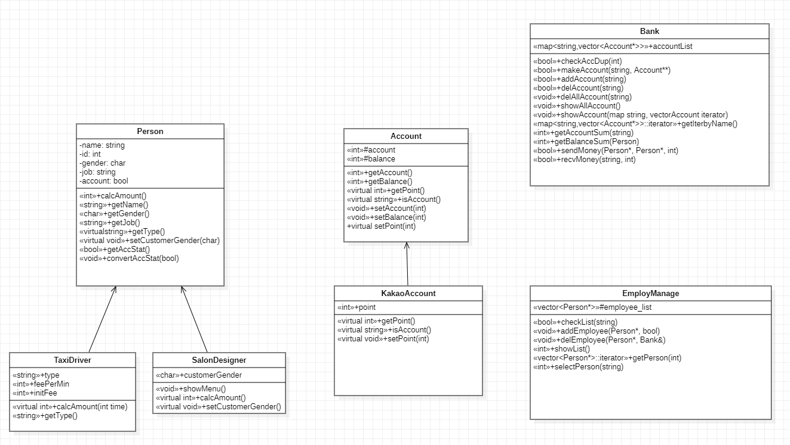

# somoim

- 동아리 별 게시판/채팅창/자료실 프로그램
- 모임을 만들어서 모임원들끼리 위 세 가지 기능을 운영함

 

- 빌드 방법
    - server와 client 폴더 각각에서 make 명령어 수행

 

- 아쉬운점
    1. 동아리 별 운영자/일반멤버 나누고싶었는데 못함
    2. 동아리 정보 및 게시물 저장못함
    3. 예외처리 못함